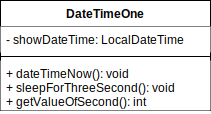
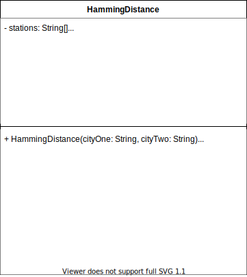

# Project 1 - _HammingDistance & DateTimeOne_
The objective  of this programming project  is to implement aJava program which can read a file, parse data,perform  some  calculation  on  data,  and some basics  on Date/Time. After  completing  the  project, students will  have  an  intermediate understanding  of reading data from a file and performing  some calculation on data and basics of Date/Time function in Java.

---

## **Problem Solving Phase**
In order to start building the two classes the first thing that I did was to check out the code within `Driver.java` and the instructions that it came with. From the starting code within this class, the following is what I saw I needed to do for each class:

1. **`DateTimeOne.java`**: I needed to crate two new methods within this class. the first one named _`.getValueOfSecond()`_ while the second one was named _`.sleepForThreeSec()`_. the following is a list of task with detailed description of what each method needs to do.

    - [x] _`getValueOfSecond()`_: this method will get the value of second from the time information obtained by the program wihtin the _`dateTimeNow()`_ method. The focus of this method is to return the obtained second time value when called. Additionaly within the method it is required to check if the second value is 58 and print out the string:
        > `The value of Second now: 58` 
    - [x] _`sleepForThreeSec()`_: from the code build in the driver this method is only alowed to sleep the program for three seconds. The runtime exceptions that may occur within the method are needed to be handled within the method since the driver cannot be edited. For this method I will use the **`TimeUnit`** class which allows me to sleep the program without using threads or runnable within the code.
1. **`HammingDistance`**: Using the information witin the driver it is known that this class has to implement at least a constructor and the _`.toString()`_ method. wihtin the other methods of the class it is needed to:
    * Read a file and store its information
    * Modify the information obtained from the file
    * Calculate Hamming Distances between two stations
    * Find the number of Hamming distances equal to a certain value

    All of these tasks have to be done within the constructor. However, the code for these tasks is done wihtin a method in the class for each.

---
## **Coding Blocks**

### 1. `DateTimeNow`



To store the time value as a class instance variable when the method _`.now()`_ from the **LocalDatetime** clase is invoked. The private instance variable showDateTime of the tipe LocalDateTime is created. this variable is used within the void public method _`dateTimeNow()`_ to obtaine the second value and return it with the following code line.
```java
int secondNow = showDateTime.getSecond();
```
Wihtin the _`sleepForThreeSec()`_ method the following code is used to sleep the program for three seconds. The InterruptedException that may happen is handled within the method with a try-catch block.
```java
TimeUnit.MILLISECONDS.sleep(3000);
```
### 2. `HammingDistance`



When selecting the variables for this class I focussed on what was the  required output. Thus, there is a variable asociated to each input variable. Aditionally there are two static variables. One is the array of stations ID extracted from the file while the other is the reference station to which the input is compared to, to measure the hamming distance. The required output of the class when the method _`toString()`_ is called is as follows:
```java
The Hamming distance between Norman and NEWK is 3; between Norman and WEBR is 4. 
For NEWK: Number of stations with Hamming Distance 3: 20. 
For WEBR: Number of stations with Hamming Distance 4: 90.
```
#### 2.1. Instace variables

| Variable | Type | <center>Description</center> |
|---|---|---|
| `stations`| **String[]** | contains the value of the STID for each station contained within the file. this variable is assigned the return of the method  `getStations()`|
| `DEFAULT_STATION` | **String** | Value of this variable is **NRMN**. This is the variable that determines the first two hamming distances in the output.
| `cityOne` | **String** | The value of the first input in the constructor is assingned to this variable. This variable is present within the output String when `toString()` is called |
| `cityTwo` | **String** | The value of the second input in the constructor is assingned to this variable. This variable is present within the output String when `toString()` is called |
| `hdCityOne` | **int** | this variable is initialized within the constructor, and the value assigned to it, is the found hamming distance between `DEFAULT_STATION` and `cityOne`. This variable is present within the output String when `toString()` is called | 
| `hdCityTwo` | **int** | this variable is initialized within the constructor, and the value assigned to it, is the found hamming distance between `DEFAULT_STATION` and `cityTwo`. This variable is present within the output String when `toString()` is called |
| `hdStationsCityOne` | **int[]** | this variable is initialized within the constructor, and the value assigned to it, is and array with hamming distances found between each on of the stations wihtin `stations` and `cityOne`. |
| `hdStationsCityTwo` | **int[]** | this variable is initialized within the constructor, and the value assigned to it, is and array with hamming distances found between each on of the stations wihtin `stations` and `cityTwo`. |
| `hdCityOneRepetition` | **int** | this variable is initialized within the constructor. Its value is the number of times that the `hdCityOne` is present within the array `hdStationsCityOne`. The value of this variable is one of the outputs when `toString()` is called.|
| `hdCityTwoRepetition` | **int** | this variable is initialized within the constructor. Its value is the number of times that the `hdCityTwo` is present within the array `hdStationsCityTwo`. The value of this variable is one of the outputs when `toString()` is called.|

#### 2.2. Implemented Methods
For the methods implemented in this class, eight of them are getters for the private non-static variables. There are also two private methods that are in charge of reading all the lines in the file `MESONET.txt` which contains the stations IDs, and to modify the strings obtained from the file. the remaining three methods are statics and they provide a way to calculate the hamming distance between two equaly size Strings, and to find the number of times that an integer repeats within a given array. In the following list the non-getter methods are described.
* _`readFile(fileName: String): String[]`_. It is a private static method that reads the file with the name of the given String. The contents of the file are then stored wihtin a String[] array. The array legnth is the number of lines present in the file, and this is the return value of this method.
* _`getStations(): String[]`_. The core of this method if to modify the String array returned by the _`readFile(fileName)`_ method. The resulting array after the modifications is an array containing only the values of the stations IDs.

Both of these methods are private and statics since the return value for both of them is information regarding for and instance of this class only. these are immutable unless the `MESONET.tx` file is changed.

* _`findHammingDistance(String: word, String: compareTo): int`_. It provides a way to find the hamming distance between the given `word` and `compareTo`. This method checks first if the legth of both String is the same. If the values are different it returns a value of _**-1**_. After checking lengths the method goes into creating a char array that contains the letter of the String. It then compares each char within the array to find the hamming distance which is the return value.
* _`findHammingDistance(String: word, String[]: array): int[]`_ It is an overload of the previous method. this method implements the method above over a loop to find the hamming distance of between the given word and each word within the array. the return value is an array of integers that contains the found hamming distances. A hamming distance between `word` and the a given String contained in `array` at index `i` is presented at the same index value within the returned array.

These methods are statics member of the class. I though that to find a hamming distance it is not so necesary to created an instance of the class. callinf this method with the class name is just enought.

* _`findRepetitionsWithinArray(int: key, int[], array): int`_. As the method is named, its purpose is to find the number of times the `key` is present in `array`, which is the return value for this method.
* _`toString(): String`_. it returns a String with the format of

    ```java
    "The Hamming distance between Norman and " + cityOne + " is " 
        + hdCityOne + "; between Norman and " + cityTwo + " is " + hdCityTwo + "." + '\n' 
        + "For " + cityOne + ": Number of stations with Hamming Distance " + hdCityOne + ": "
        + hdCityOneRepetition + "." + '\n'
        + "For " + cityTwo + ": Number of stations with Hamming Distance " + hdCityTwo + ": "
        + hdCityTwoRepetition + ".";
    ```

#### 2.3. Constructor
Observed from the Driver, the contructor is intialized with two given values of stations. Most of the methods in the class are called within the constructor and is build as follows.
```java
    public HammingDist(String word1, String word2){
		this.cityOne = word1;
		this.cityTwo = word2;
		
		hdCityOne = findHammingDistance(word1, DEFAULT_STATION);
		hdCityTwo = findHammingDistance(word2, DEFAULT_STATION);
		
		hdStationsCityOne = findHammingDistance(word1, stations);
		hdStationsCityTwo = findHammingDistance(word2, stations);
		
		hdCityOneRepetition = findRepetitionsWithinArray(hdCityOne, hdStationsCityOne);
		hdCityTwoRepetition = findRepetitionsWithinArray(hdCityTwo, hdStationsCityTwo);
	}
```